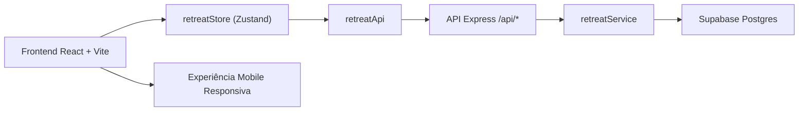
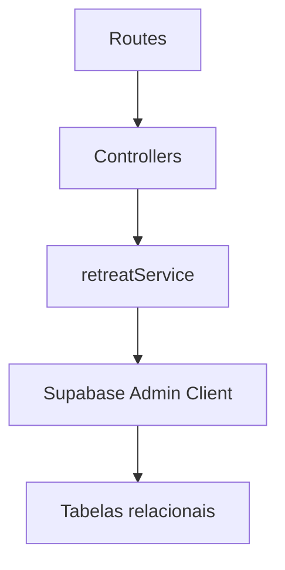
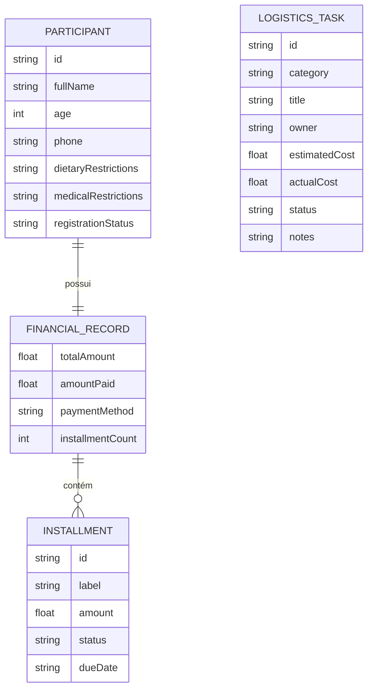

## 1. Desenho da Arquitetura


## 2. Descrição da Tecnologia
- Frontend: React 18 + TypeScript + Vite + Tailwind CSS + React Router DOM + Zustand
- Ferramenta de Inicialização: `vite-init` com template `react-express-ts`
- Backend: Express 4 + TypeScript servindo rotas REST em `/api/*`
- Banco de Dados: Supabase Postgres com acesso seguro via `SUPABASE_SERVICE_ROLE_KEY` apenas no backend
- Ícones: `lucide-react`
- Testes: Vitest + React Testing Library no frontend e testes da store com mocks da API

## 3. Definições de Rotas
| Rota | Propósito |
|-------|---------|
| / | Dashboard principal com visão geral do retiro |
| /participantes | Cadastro, busca e gerenciamento dos participantes |
| /financeiro | Controle de pagamentos, parcelas e histórico financeiro |
| /logistica | Checklist de compras, contratos e tarefas operacionais |

## 4. Definições de API
### Tipos principais
```ts
export type RegistrationStatus = "Confirmada" | "Pendente" | "Cancelada";
export type PaymentMethod = "PIX" | "Dinheiro" | "Boleto" | "CartaoCredito";
export type InstallmentStatus = "Paga" | "Pendente";
export type TaskStatus = "Pendente" | "EmAndamento" | "Concluida";

export interface Installment {
  id: string;
  label: string;
  amount: number;
  status: InstallmentStatus;
  dueDate?: string;
}

export interface FinancialRecord {
  totalAmount: number;
  amountPaid: number;
  paymentMethod: PaymentMethod;
  installmentCount: number;
  installments: Installment[];
}

export interface Participant {
  id: string;
  fullName: string;
  age: number;
  phone: string;
  dietaryRestrictions: string;
  medicalRestrictions: string;
  registrationStatus: RegistrationStatus;
  financial: FinancialRecord;
}

export interface LogisticsTask {
  id: string;
  category: "Compras" | "Contratos";
  title: string;
  owner: string;
  estimatedCost: number;
  actualCost: number;
  status: TaskStatus;
  notes: string;
}
```

### Endpoints implementados
| Método | Endpoint | Objetivo |
|--------|----------|----------|
| GET | /api/participants | Listar participantes |
| POST | /api/participants | Criar participante |
| PATCH | /api/participants/:id | Atualizar participante |
| PATCH | /api/participants/:id/financial | Atualizar financeiro do participante |
| GET | /api/logistics | Listar tarefas logísticas |
| POST | /api/logistics | Criar tarefa logística |
| PATCH | /api/logistics/:id/status | Atualizar status da tarefa |
| GET | /api/health | Health check para deploy |

## 5. Diagrama da Arquitetura do Servidor


## 6. Modelo de Dados
### 6.1 Definição do Modelo


### 6.2 Definição Inicial de Dados
```sql
-- Estrutura principal persistida no Supabase
CREATE TABLE participantes (
  id UUID PRIMARY KEY,
  nome TEXT NOT NULL,
  idade INTEGER NOT NULL,
  telefone TEXT NOT NULL,
  restricoes_alimentares TEXT,
  restricoes_medicas TEXT,
  status_inscricao TEXT NOT NULL
);

CREATE TABLE financeiro (
  id UUID PRIMARY KEY,
  participante_id UUID NOT NULL,
  valor_total NUMERIC NOT NULL,
  valor_pago NUMERIC NOT NULL,
  forma_pagamento TEXT NOT NULL,
  num_parcelas INTEGER NOT NULL,
  status_geral TEXT NOT NULL
);

CREATE TABLE financeiro_parcelas (
  id UUID PRIMARY KEY,
  financeiro_id UUID NOT NULL,
  rotulo TEXT NOT NULL,
  valor NUMERIC NOT NULL,
  status TEXT NOT NULL,
  vencimento DATE
);

CREATE TABLE checklist_organizacao (
  id UUID PRIMARY KEY,
  categoria TEXT NOT NULL,
  tarefa TEXT NOT NULL,
  responsavel TEXT NOT NULL,
  valor_estimado NUMERIC NOT NULL,
  valor_gasto NUMERIC NOT NULL,
  status TEXT NOT NULL,
  observacoes TEXT NOT NULL
);
```

## 7. Estrutura Inicial de Pastas
```text
.
|-- .trae/
|   `-- documents/
|       |-- prd-retiro-ii-ipr-camacan.md
|       `-- arquitetura-tecnica-retiro-ii-ipr-camacan.md
|-- api/
|   |-- routes/
|   |-- controllers/
|   |-- services/
|   `-- data/
|-- shared/
|   `-- types/
|-- src/
|   |-- components/
|   |-- hooks/
|   |-- pages/
|   |-- utils/
|   |-- store/
|   `-- styles/
|-- public/
|-- package.json
`-- vite.config.ts
```

## 8. Estratégia de Implementação
- Frontend consome a API própria via `src/services/retreatApi.ts`
- Backend usa `api/services/retreatService.ts` para mapear o domínio do frontend para o schema do Supabase
- Estado global centralizado em Zustand para participantes, pagamentos e checklist
- Componentização focada em blocos pequenos, reusáveis e coerentes com a estética futurista minimalista
- Deploy recomendado na Vercel com funções serverless para `/api/*` e frontend estático na mesma origem
