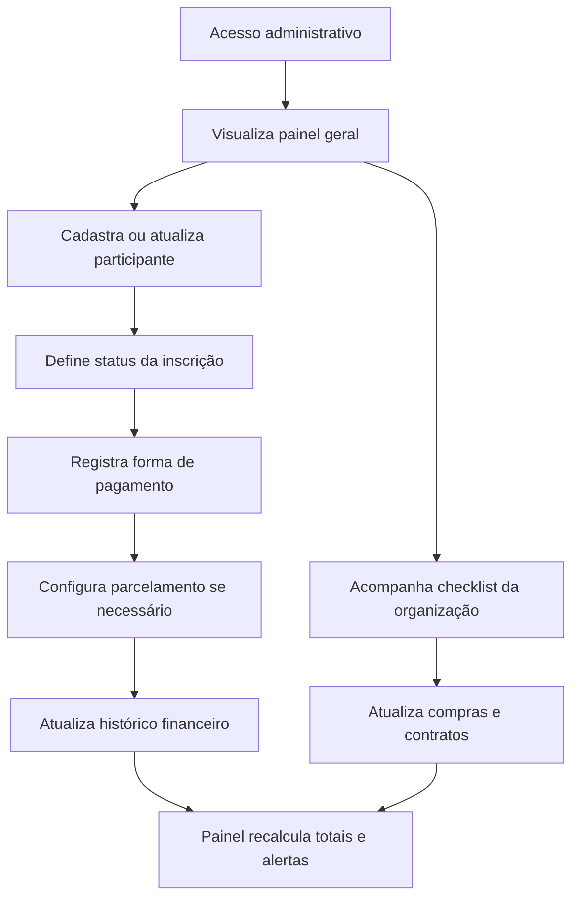

## 1. Visão do Produto
Sistema unificado para organizar o "Retiro da II IPR de Camacan" com foco em inscrições, controle financeiro e logística operacional em uma interface futurista minimalista.
- Resolve a dispersão de informações da organização em planilhas, mensagens e anotações isoladas.
- Atende equipe organizadora, secretaria e tesouraria com visão centralizada e rápida do status do retiro.

## 2. Funcionalidades Centrais

### 2.1 Papéis de Usuário
| Papel | Método de Acesso | Permissões Principais |
|------|------------------|-----------------------|
| Organização | Login administrativo local | Cadastrar participantes, atualizar pagamentos, acompanhar checklist |
| Tesouraria | Login administrativo local | Registrar pagamentos, definir parcelamentos, acompanhar inadimplência |
| Coordenação | Login administrativo local | Visualizar panorama geral, revisar contratos e tarefas logísticas |

### 2.2 Módulos Essenciais
1. **Painel Geral**: visão consolidada com KPIs do retiro, resumo financeiro e progresso da organização.
2. **Participantes**: cadastro, edição, busca rápida, filtros por status e visualização de dados pessoais e restrições.
3. **Financeiro**: valor total, valor pago, forma de pagamento, parcelamento, histórico de parcelas e status financeiro por participante.
4. **Checklist e Logística**: compras, contratos, grandes pagamentos, status operacional e acompanhamento de valores previstos e realizados.
5. **Camada Mobile Adaptativa**: experiência responsiva otimizada para uso em celular, mantendo os mesmos módulos com navegação por abas.

### 2.3 Detalhamento das Páginas
| Nome da Página | Nome do Módulo | Descrição da Funcionalidade |
|-----------|-------------|---------------------|
| Painel Geral | Resumo executivo | Exibe total de inscritos, vagas ocupadas, arrecadação, saldo pendente e progresso logístico |
| Painel Geral | Alertas rápidos | Mostra participantes com pagamento pendente, tarefas urgentes e contratos em aberto |
| Participantes | Formulário de inscrição | Permite cadastrar nome completo, idade, telefone, restrições alimentares ou médicas e status da inscrição |
| Participantes | Listagem futurista | Exibe tabela ou grade com busca rápida, filtros por status e destaque visual por situação |
| Financeiro | Resumo por participante | Mostra valor total, valor pago, saldo em aberto e forma de pagamento escolhida |
| Financeiro | Parcelamento | Permite definir de 1x a 10x para boleto ou cartão e marcar cada parcela como paga ou pendente |
| Financeiro | Histórico financeiro | Lista eventos financeiros recentes e facilita revisão individual |
| Checklist | Compras | Controla itens, responsável, valor estimado, valor gasto e status da tarefa |
| Checklist | Contratos | Controla pousada, cozinheira e fornecedores com valores e estados operacionais |
| Checklist | Indicadores visuais | Aplica marcadores luminosos para pendente, em andamento e concluído |

## 3. Processo Central
O fluxo principal começa com o cadastro dos participantes. Após a inscrição, a equipe acompanha o status financeiro de cada pessoa, registra pagamentos e parcelamentos quando necessário. Em paralelo, a coordenação mantém o checklist operacional atualizado para garantir compras, contratos e pagamentos logísticos em dia. O painel geral sintetiza esses três blocos para decisões rápidas.

## 4. Design da Interface
### 4.1 Estilo Visual
- Tema principal: dark mode profundo com base em grafite e preto azulado
- Cores de destaque: ciano neon sutil, roxo elétrico suave e verde neon moderado para estados positivos
- Botões: superfícies escuras com bordas finas translúcidas, brilho discreto no hover e cantos levemente arredondados
- Tipografia: títulos geométricos modernos e texto limpo de alta legibilidade
- Layout: dashboard modular com navegação lateral no desktop e abas inferiores no mobile
- Ícones: minimalistas, finos e tecnológicos

### 4.2 Visão de Design por Página
| Nome da Página | Nome do Módulo | Elementos de UI |
|-----------|-------------|-------------|
| Painel Geral | KPIs e alertas | Cartões translúcidos escuros, linhas finas, borda com brilho sutil, indicadores numéricos compactos |
| Participantes | Formulário | Campos em grade, labels discretos, foco com halo neon suave, botões de ação enxutos |
| Participantes | Listagem | Tabela com linhas separadoras finas, busca em tempo real e badges de status luminosos |
| Financeiro | Cartões financeiros | Blocos com progresso, valores destacados, seletor de pagamento e painel de parcelas |
| Checklist | Tarefas e contratos | Linhas operacionais com checkbox customizado, chips de estado neon e resumo de custos |

### 4.3 Responsividade
- Abordagem desktop-first com adaptação completa para telas móveis
- Navegação lateral recolhível no desktop e barra inferior no mobile
- Tabelas convertem para cartões empilhados em telas pequenas
- Inputs e botões mantêm área de toque confortável para operação em celular

### 4.4 Diretriz de Experiência
- Interface deve transmitir controle, clareza e precisão operacional
- Microinterações devem ser rápidas e discretas, sem poluição visual
- Cada módulo precisa priorizar leitura instantânea e atualização simples de estado
- O resultado visual deve lembrar um painel de comando contemporâneo, limpo e confiável
